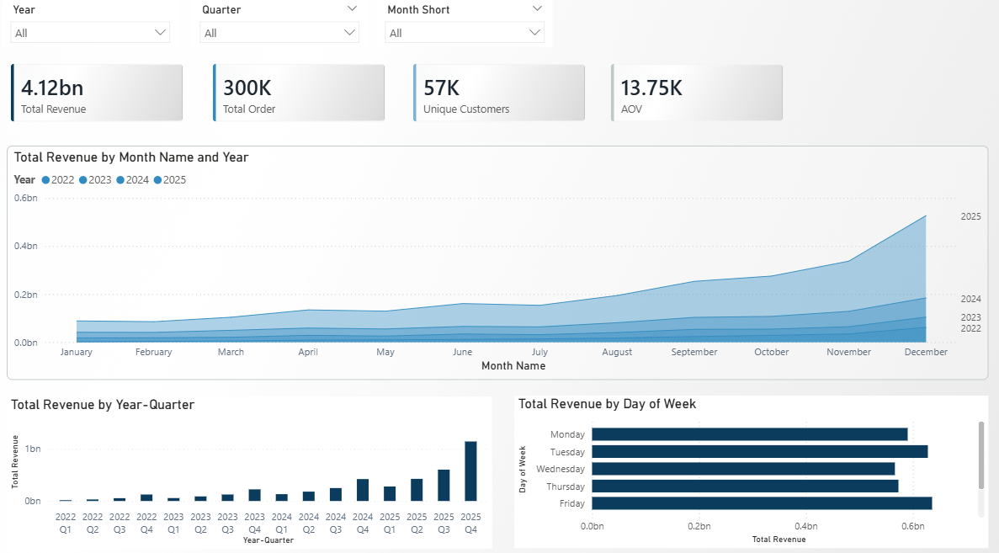
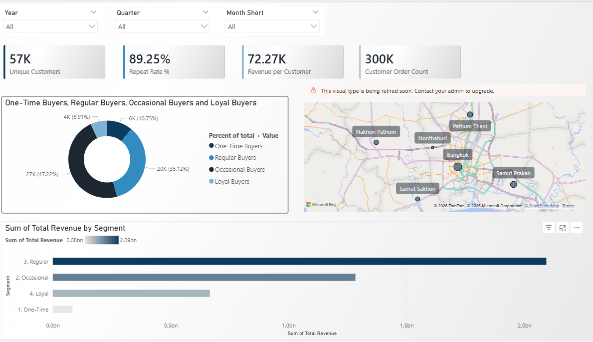

# 🛒 Shopee Thailand — E-Commerce Analytics Dashboard


> **End-to-end e-commerce analytics portfolio project** analyzing 300,000 orders across 4 years (2022–2025) from a simulated Shopee Thailand dataset — covering sales performance, customer segmentation, campaign effectiveness, and logistics.

---

## 📊 Dashboard Preview

### Page 1 · Sales Overview


### Page 2 · Customer Analysis


---

## 🗂️ Dataset Overview

| Table | Rows | Description |
|-------|------|-------------|
| `shopee_orders_thailand` | 300,000 | Orders with revenue, fees, campaign |
| `shopee_customers_thailand` | 60,000 | Customer profiles and location |
| `shopee_products_thailand` | 4,880 | Products, categories, commission rates |
| `shopee_sellers_thailand` | 200 | Seller profiles and logistics info |
| `shopee_campaigns_thailand` | 20 | Campaign details and types |
| `shopee_product_campaign_thailand` | 21,894 | Product–campaign discount mapping |
| `shopee_shipments_thailand` | 360,187 | Delivery status and courier data |
| `shopee_reviews_thailand` | 360,187 | Customer reviews per order item |

---

## 🔑 Key Business Insights

### 📈 Sales Performance
- **Total Revenue (2022–2025): ฿4.12 Billion** across 300,000 orders
- Platform grew **11x in 4 years** — from ฿215M (2022) → ฿2.44B (2025)
- **AOV remained stable at ~฿13,700–13,900** — growth driven by volume, not price increases
- **Q4 is peak season**: December alone contributes ~฿877M, followed by November (฿564M)
- Revenue is distributed evenly across weekdays — customers shop habitually, not just on weekends

| Year | Revenue (THB) | Orders | YoY Growth |
|------|--------------|--------|------------|
| 2022 | 215.9M | 15,503 | — |
| 2023 | 490.7M | 35,663 | +127% |
| 2024 | 977.0M | 70,880 | +99% |
| 2025 | 2,441.2M | 177,954 | +150% |

### 👤 Customer Segmentation
- **57,075 unique customers** across 6 provinces, centered in Greater Bangkok
- **Repeat Rate: 89.25%** — majority of customers return to purchase again
- Customer segments by purchase frequency:

| Segment | Orders | Customers | Share |
|---------|--------|-----------|-------|
| One-Time | 1 | 6,135 | 10.7% |
| Occasional | 2–5 | 26,952 | 47.2% |
| Regular | 6–10 | 20,042 | 35.1% |
| Loyal | 11+ | 3,946 | 6.9% |

- **Regular buyers (6–10 orders) generate the highest total revenue** despite not being the largest segment
- Bangkok and surrounding provinces (Samut Prakan, Pathum Thani) account for the majority of customers

---

## 🗃️ Repository Structure

```
shopee-thailand-analytics/
│
├── README.md
│
├── sql/
│   ├── 01_sales_performance.sql
│   ├── 02_customer_segmentation.sql
│   ├── 03_campaign_effectiveness.sql
│   └── 04_logistics_performance.sql
│
├── powerbi/
│   └── shopee_dashboard.pbix
│
└── insights/
    └── screenshots/
        ├── page1_sales.png
        └── page2_customers.png
```

---

## 🔧 Data Model

The Power BI data model follows a **star schema** with `shopee_orders_thailand` as the central fact table:

```
dimDate ──────────────────► shopee_orders_thailand ◄─── shopee_customers_thailand
                                     │
                    ┌────────────────┼──────────────────┐
                    ▼                ▼                  ▼
         shopee_campaigns    shopee_order_items   (shipments & reviews
            _thailand           _thailand          via order_item_id)
                                    │
                          ┌─────────┴──────────┐
                          ▼                    ▼
               shopee_products         shopee_sellers
                 _thailand               _thailand
                      │
                      ▼
           shopee_product_campaign
                _thailand
```

---

## ⚙️ Tools & Technologies

| Tool | Usage |
|------|-------|
| **Power BI Desktop** | Data modeling, DAX measures, dashboard design |
| **Power Query (M)** | Data transformation and cleaning |
| **DAX** | KPI measures, time intelligence, customer segmentation |
| **SQL** | Analytical queries for business questions |

---

## 📐 DAX Highlights

```dax
-- Customer Segmentation (Calculated Column)
Customer Segment =
VAR cnt =
    CALCULATE(
        COUNTROWS(shopee_orders_thailand),
        ALLEXCEPT(shopee_orders_thailand,
                  shopee_orders_thailand[customer_id])
    )
RETURN
    SWITCH(
        TRUE(),
        cnt = 1,               "1. One-Time",
        cnt >= 2 && cnt <= 5,  "2. Occasional",
        cnt >= 6 && cnt <= 10, "3. Regular",
        cnt >= 11,             "4. Loyal"
    )

-- YoY Revenue Growth
YoY Growth % =
DIVIDE(
    [Total Revenue] - CALCULATE([Total Revenue], SAMEPERIODLASTYEAR(dimDate[Date])),
    CALCULATE([Total Revenue], SAMEPERIODLASTYEAR(dimDate[Date]))
)

-- Repeat Rate
Repeat Rate % =
DIVIDE(
    [Unique Customers] - [One-Time Buyers],
    [Unique Customers]
)
```

---

## 💡 Business Recommendations

1. **Double down on Q4 campaigns** — Launch warm-up promotions from September to build momentum ahead of 10.10, 11.11, and 12.12
2. **Target Occasional buyers for retention** — At 47% of the base, converting even 10% to Regular buyers would significantly lift revenue
3. **Investigate AOV plateau** — AOV has been flat at ~฿13,700 for 4 years; upsell and bundle strategies could unlock incremental revenue
4. **Expand beyond Bangkok** — 6 provinces dominate; geographic expansion represents untapped growth

---

*Dataset is simulated for educational and portfolio purposes.*
