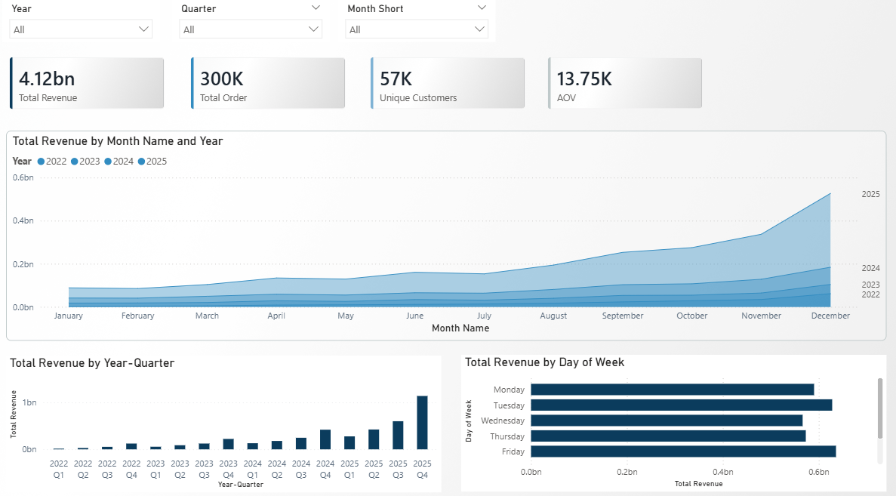
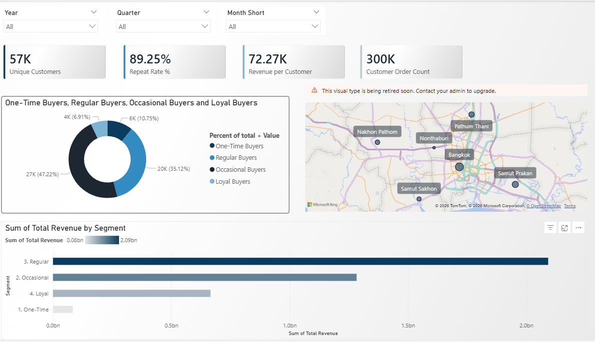
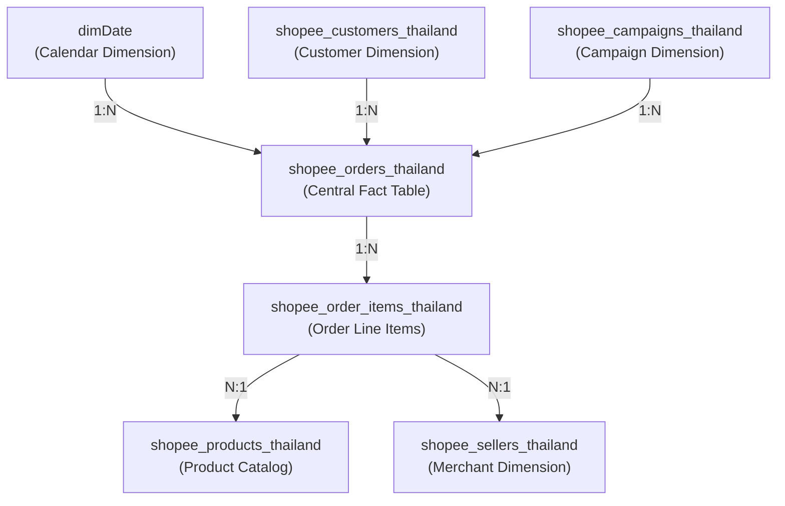
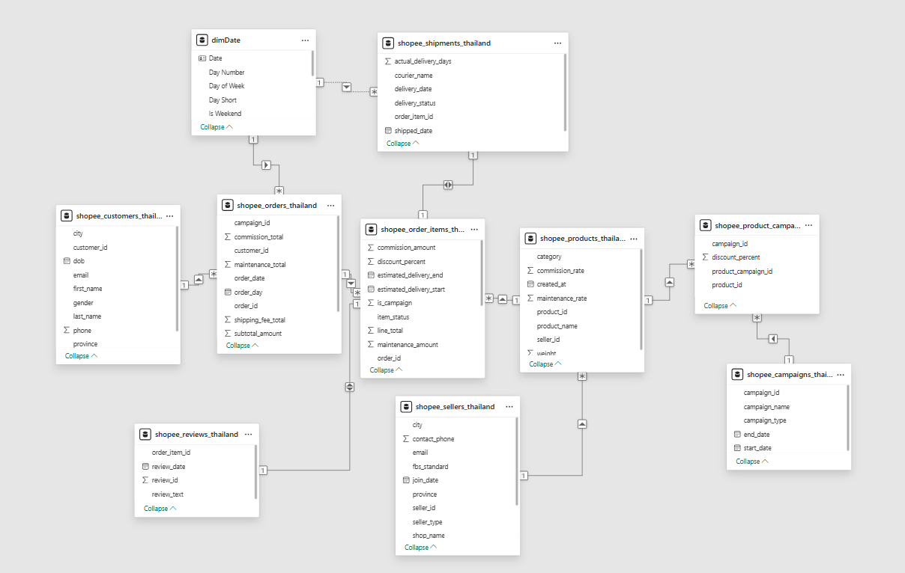

# Shopee Thailand — E-Commerce Analytics Dashboard

<p>
  
  
  
  
  
</p>

> **End-to-End E-Commerce Analytics Portfolio Project** analyzing 300,000 orders across 4 years (2022–2025) from a simulated Shopee Thailand dataset — covering multi-year sales performance, customer cohort retention, campaign effectiveness, and logistics fulfillment.

---

##  &nbsp;Dashboard Previews

### Page 1 · Sales Performance & Executive Overview


### Page 2 · Customer Segmentation & Retention Analysis


---

##  &nbsp;Dataset Architecture

| Table | Records | Key Schema Attributes |
|---|---|---|
| `shopee_orders_thailand` | 300,000 | Order ID, Date, Gross Revenue, Platform Fees, Campaign Mapping |
| `shopee_customers_thailand` | 60,000 | Customer ID, Demographics, Geographic Location (Provinces) |
| `shopee_products_thailand` | 4,880 | Product ID, Category, Unit Price, Commission Rates |
| `shopee_sellers_thailand` | 200 | Seller ID, Fulfillment Type, Courier Service |
| `shopee_campaigns_thailand` | 20 | Campaign Name, Start/End Dates, Promotional Discount Types |
| `shopee_product_campaign_thailand` | 21,894 | Cross-reference Product & Campaign Discount Structure |
| `shopee_shipments_thailand` | 360,187 | Logistics Fulfillment SLA, Delivery Duration, Courier Status |
| `shopee_reviews_thailand` | 360,187 | Customer Satisfaction Rating (1–5 Stars) & Feedback |

> Source: [Shopee TH Customer Journey and Operations Dataset (Kaggle)](https://www.kaggle.com/datasets/hninshwezinhlaing/shopee-th-customer-journey-and-operations-dataset)

---

##  &nbsp;Key Business Insights

### 1. Multi-Year Sales Velocity
- **Total Gross Revenue (2022–2025): ฿4.12 Billion** across 300,000 transactions.
- **11x Revenue Growth in 4 Years:** Expanded from ฿215.9M (2022) to ฿2.44B (2025).
- **Stable AOV (฿13,700 – ฿13,900):** Revenue acceleration was driven purely by transaction volume rather than price inflation.
- **Q4 Seasonality Peak:** December alone accounts for ฿877M, followed by November (฿564M) driven by 11.11 and 12.12 Mega Days.

| Year | Gross Revenue (THB) | Order Count | YoY Growth |
|:---:|:---:|:---:|:---:|
| 2022 | 215.9M | 15,503 | — |
| 2023 | 490.7M | 35,663 | **+127%** |
| 2024 | 977.0M | 70,880 | **+99%** |
| 2025 | 2,441.2M | 177,954 | **+150%** |

### 2. Customer Cohort Segmentation
- **57,075 Unique Customers** analyzed across Greater Bangkok and regional economic hubs.
- **High Repeat Purchase Rate (89.25%):** Strong platform retention with predictable lifetime value.
- **Regular Buyers Drive Margin:** Customers making 6–10 orders generate the highest overall revenue contribution.

| Customer Segment | Frequency Range | Customer Count | Volume Share |
|---|---|---|---|
| **One-Time** | 1 order | 6,135 | 10.7% |
| **Occasional** | 2–5 orders | 26,952 | 47.2% |
| **Regular** | 6–10 orders | 20,042 | 35.1% |
| **Loyal** | 11+ orders | 3,946 | 6.9% |

---

##  &nbsp;Data Model Architecture

The semantic model is architected as a **Star Schema** centered around `shopee_orders_thailand`:


```mermaid
flowchart TD
    DimDate["dimDate<br/>(Calendar Dimension)"] -->|1:N| FactOrders["shopee_orders_thailand<br/>(Central Fact Table)"]
    DimCustomer["shopee_customers_thailand<br/>(Customer Dimension)"] -->|1:N| FactOrders
    DimCampaign["shopee_campaigns_thailand<br/>(Campaign Dimension)"] -->|1:N| FactOrders
    
    FactOrders -->|1:N| FactItems["shopee_order_items_thailand<br/>(Order Line Items)"]
    FactItems -->|N:1| DimProduct["shopee_products_thailand<br/>(Product Catalog)"]
    FactItems -->|N:1| DimSeller["shopee_sellers_thailand<br/>(Merchant Dimension)"]
```

### Tabular Model View


---

##  &nbsp;Repository Structure

```
shopee-thailand-analytics/
├── sql/
│   ├── 01_sales_performance.sql      # Multi-year revenue & seasonality trends
│   ├── 02_customer_segmentation.sql   # RFM frequency & cohort classification
│   ├── 03_campaign_effectiveness.sql  # Double-digit promotional attribution
│   └── 04_logistics_performance.sql   # Courier SLA & delivery duration metrics
├── powerbi/
│   └── shopee_dashboard.pbix         # Compiled Power BI reporting package
├── insights/
│   └── screenshots/                   # Exported visual previews
└── README.md
```

---

##  &nbsp;Core DAX Calculations

### 1. Dynamic Customer Segmentation (Calculated Column)
```dax
Customer Segment =
VAR OrderCount =
    CALCULATE(
        COUNTROWS(shopee_orders_thailand),
        ALLEXCEPT(shopee_orders_thailand, shopee_orders_thailand[customer_id])
    )
RETURN
    SWITCH(
        TRUE(),
        OrderCount = 1,                      "1. One-Time",
        OrderCount >= 2 && OrderCount <= 5,  "2. Occasional",
        OrderCount >= 6 && OrderCount <= 10, "3. Regular",
        OrderCount >= 11,                    "4. Loyal"
    )
```

### 2. Year-over-Year (YoY) Revenue Growth %
```dax
YoY Growth % =
VAR CurrentRevenue = [Total Revenue]
VAR PriorRevenue   = CALCULATE([Total Revenue], SAMEPERIODLASTYEAR(dimDate[Date]))
RETURN
    DIVIDE(CurrentRevenue - PriorRevenue, PriorRevenue, 0)
```

### 3. Customer Repeat Rate %
```dax
Repeat Rate % =
DIVIDE(
    [Unique Customers] - [One-Time Buyers],
    [Unique Customers],
    0
)
```

---

##  &nbsp;Strategic Business Takeaways

1. **Pre-Q4 Campaign Warm-Up:** Launch early-stage discovery campaigns starting in September to capture top-of-funnel traffic ahead of peak 11.11 / 12.12 Mega Days.
2. **Convert the Occasional Cohort (47%):** Transitioning just 10% of occasional buyers (2–5 orders) into regular buyers (6–10 orders) yields the highest incremental margin lift.
3. **Unlock AOV Expansion via Bundling:** Address the 4-year plateau in AOV (~฿13,700) through cross-category bundling and minimum-spend tier vouchers.
4. **Regional Expansion Beyond Bangkok:** Diversify marketing spend into emerging provincial clusters outside the Greater Bangkok metropolitan area.

---

<p align="center">
  <sub>Simulated e-commerce analytics case study built for portfolio evaluation.</sub>
</p>
